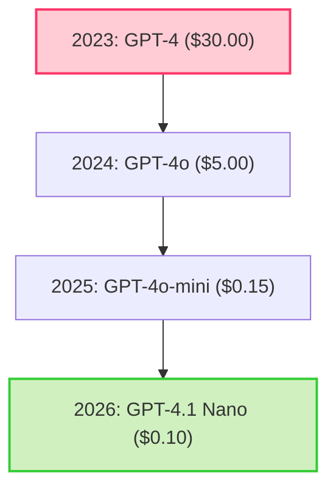

In March 2023, OpenAI released GPT-4. It was a revolutionary moment for software engineering, but it came with a steep toll booth: **$30.00 per million input tokens** and **$60.00 per million output tokens**. At that rate, running recursive multi-agent reasoning, deep RAG pipelines, or autonomous agent loops was an extreme luxury reserved only for well-funded enterprises.

Fast forward to **May 2026**.

OpenAI's GPT-4.1 Nano and Google's Gemini 3.5 Flash-Lite are priced at **$0.10 per million input tokens**. That represents a staggering **99.6% price reduction** in just three years. 

How did we get here? How can companies provide cognitive processing power at a fraction of a fraction of a cent? In this deep dive, we will analyze the technical, hardware, architectural, and economic forces driving this race to zero, and outline how software engineers should position their stacks to capitalize on this shifting paradigm.

> 🧮 **Calculate your current savings:** Use our [AI API Pricing Calculator](/ai-api-pricing-calculator/) to see how much cheaper your production workloads are compared to previous years.

---

## The Historical Collapse of Token Costs (2023 - 2026)

To understand where we are going, we must look at the rate of decay over the last three years. The table below outlines the price per million input tokens for standard "flagship" and "lightweight" models:

| Era | Flagship Model | Input / 1M (Flagship) | Lightweight Model | Input / 1M (Lightweight) |
| :--- | :--- | :--- | :--- | :--- |
| **Q1 2023** | GPT-4 | $30.00 | GPT-3.5-Turbo | $2.00 |
| **Q1 2024** | GPT-4-Turbo | $10.00 | GPT-3.5-Turbo (v2) | $0.50 |
| **Q3 2024** | GPT-4o | $5.00 | GPT-4o-mini | $0.15 |
| **Q4 2025** | GPT-5 | $10.00 | GPT-5 mini | $0.25 |
| **May 2026** | **GPT-5.5** | **$5.00** | **GPT-4.1 Nano** | **$0.10** |



---

## The Core Technical Forces Driving the Price Collapse

This pricing decline is not a philanthropic marketing play. It is driven by hard computer science and hardware physics breakthroughs that have radically lowered the cost of generating a single token.

### 1. Hardware Advancements: The GPU Leap (Blackwell vs. H100)
The deployment of Nvidia's **Blackwell (B200)** architecture and custom hyperscaler silicon (like Google's TPU v5p and v6e) has transformed data center economics.
- **Compute Density:** Blackwell delivers up to a **25x reduction** in cost and energy consumption compared to the Hopper (H100) generation when executing inference on large models.
- **Memory Bandwidth:** High Bandwidth Memory (HBM3e) allows GPUs to load model weights into execution registers at rates exceeding **8 TB/s**. Since LLM inference is highly memory-bandwidth bound during the auto-regressive decoding phase, this bandwidth scaling translates directly to a linear increase in generation speed (tokens per second) per dollar of electricity.

### 2. Architectural Quantization (FP8, INT4, and AWQ)
In 2023, models were run at FP16 (16-bit floating-point precision). This meant a 70-billion parameter model required 140 GB of VRAM just to fit into memory, demanding at least two H100 GPUs.
- **Precision Reductions:** Through advancements like FP8 (8-bit floating point) and INT4 (4-bit integer) quantization, providers can now compress models to run at a quarter of their original memory footprint with virtually zero degradation in perplexity or cognitive reasoning scores.
- **Hardware Integration:** Modern GPU tensor cores possess native hardware acceleration for FP8 and INT4 arithmetic, allowing them to process twice to four times as many operations per clock cycle.

### 3. Sparse Architectures: Mixture of Experts (MoE)
Early LLMs were "dense," meaning every single parameter in the neural network was activated to evaluate every single word. Modern architectures (including GPT-5.5, Gemini 3, and Grok 4) utilize a **Mixture of Experts (MoE)** routing framework.
- **Dynamic Routing:** Instead of running a dense 300-billion parameter model, an MoE model routes each incoming token to a specific "expert" sub-network (e.g., a coding expert, a creative writing expert, or a translation expert).
- **Active Parameters:** For any given token, only a fraction of the model (e.g., 20-30 billion parameters) is active. The host provider only pays the computational FLOP cost of the active experts, while the developer benefits from the cognitive capacity of the entire 300-billion parameter system.

### 4. FlashAttention and KV Cache Paged Memory
In early LLMs, handling long-context prompts resulted in quadratic memory growth due to the attention matrix calculations.
- **Memory Optimization:** Algorithms like **FlashAttention-3** and **PagedAttention** (which fragments the Key-Value cache in memory similar to virtual memory paging in operating systems) have optimized how GPUs handle context.
- **Prompt Caching:** Because KV caches can now be written, read, and swapped out of HBM quickly, providers can cache the system prompts of millions of developers. If a prompt matches a pre-computed cache, the provider skips the expensive "prefill" computation step, passing a **50% to 90% discount** directly to the API user.

---

## The Geopolitical Economic Landscape: The Open-Source Threat

Commercial API providers cannot price their APIs based purely on what they *want* to charge; they must price against the cost of **self-hosting**.

```
                           ┌────────────────────────┐
                           │   Developer Strategy   │
                           └───────────┬────────────┘
                                       │
                ┌──────────────────────┴──────────────────────┐
                ▼                                             ▼
     [Commercial API Route]                         [Open-Source Route]
    - OpenAI, Google, Grok                         - Meta Llama 4, DeepSeek-R1
    - Zero infrastructure setup                    - Self-host on RunPod / AWS
    - Scalable instantly                          - Flat hardware cost
    - High-level ecosystems                        - 100% data privacy
                │                                             │
                └───────────────► [Equilibrium] ◄─────────────┘
                        Commercial APIs must price *lower*
                        than self-hosting hardware costs
                        to prevent developer migration.
```

If OpenAI charged $15.00 per million tokens for a general model, a developer could rent an A100 GPU for $1.50/hour, run a quantized open-source model (like Llama 4 or DeepSeek-R1), and achieve an effective token cost of $0.80 per million. 

To prevent developers from spinning up their own hardware clusters, OpenAI, Google, and Microsoft must price their managed APIs **below the amortization cost of rented hardware**. Open-source is acting as a hard cap on commercial AI profit margins, forcing them to squeeze their hosting margins to stay competitive.

---

## The Strategic Horizon: What Happens When Tokens are Free?

Within the next 24 months, standard text generation inputs will effectively reach **$0.00**. Hyperscalers will treat basic cognitive text tokens as a loss leader. Here is how the business models will adapt:

### 1. The Pivot to "Compute-on-Demand" (Reasoning Tokens)
As simple next-token prediction drops to zero, the value shifts to reasoning. You will not pay for the length of your input or output prompt; you will pay for the **computational cycles** the model uses to think.
- If a model spends 30 seconds generating a search tree, running verification code, and executing self-correction cycles, you will be billed for the **seconds of inference compute** consumed, not the token count.

### 2. Ecosystem Lock-In and Cloud Pull-Through
For companies like Google and Microsoft, AI APIs are a customer acquisition funnel for their broader cloud suites.
- Providing ultra-cheap tokens is a gateway drug to pull developers into their paid vector databases, security standard layers, data pipelines (BigQuery, Synapse), and high-margin cloud compute hosting platforms.

---

## Actionable Strategy for Software Architects

As an engineering leader, here is how you must design your application architecture to exploit this pricing collapse:

1.  **Stop Restricting Context Windows:** With input pricing at $0.10/M and advanced context caching, stop building complex, brittle chunking algorithms for RAG. Send full, rich contextual documents inside your prompts and let the hardware-level caching optimize the cost.
2.  **Modularize by Modality:** Audio and video processing still retain high hardware premiums. Isolate audio/visual processing steps, convert them to text schemas early in your pipeline, and handle all semantic routing within the cheap text token space.
3.  **Architect for Hybrid Routing:** Integrate open-source routing libraries (like LiteLLM or custom middleware) to dynamically send simple data extraction tasks to the $0.10 tier, reserving your flagship budgets for high-level agent planning steps.

---

## Related Pricing Guides

*   📘 [Google Gemini API Pricing Guide](/google-gemini-api-pricing-may-2026/)
*   📗 [OpenAI API Pricing Guide](/openai-api-pricing-may-2026/)
*   📊 [AI Model Comparison 2026](/ai-model-pricing-comparison-gemini-openai-grok-claude-2026/)
*   🧮 [AI API Pricing Calculator](/ai-api-pricing-calculator/)
