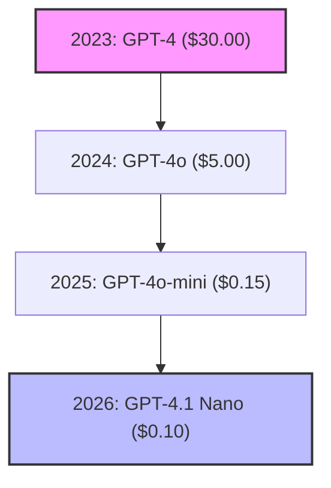

In March 2023, OpenAI released GPT-4. It was a revolutionary model, but it came with a steep price tag: **$30.00 per million input tokens** and **$60.00 per million output tokens**. Running an agent pipeline was a luxury reserved for well-funded enterprises.

Fast forward to **May 2026**.

OpenAI's GPT-4.1 Nano and Google's Gemini 2.5 Flash-Lite are priced at **$0.10 per million input tokens**. That is a **99.6% price reduction** in just three years.

This guide analyzes the technical and economic forces driving this race to $0, and what it means for the future of software engineering.

> 🧮 **Calculate your current savings:** Use our [AI API Pricing Calculator](/ai-api-pricing-calculator/) to see how much cheaper your production workloads are compared to previous years.

---

## The Historical Price Drop (Input Cost per 1 Million Tokens)

---

## The Three Forces Driving the Price War

API pricing isn't just dropping because of charity; it is driven by hard engineering breakthroughs:

### 1. Architectural Breakthroughs (Mixture of Experts & Quantization)
Early LLMs were "dense" — every parameter was active for every word generated. Today's models use **Mixture of Experts (MoE)**. Instead of activating a 100-billion parameter model, the router only activates a small 5-billion parameter "expert" sub-network matching the topic. 

Additionally, advancements in **quantization** (running models at 8-bit or 4-bit precision instead of 16-bit) allow providers to fit models onto fewer, cheaper GPUs without sacrificing intelligence.

### 2. The Open-Source Threat (DeepSeek & Llama)
If Google and OpenAI kept API rates artificially high, developers would simply download open-source models like Meta's Llama or DeepSeek and host them on cheap cloud providers (RunPod, Together AI). To keep developers locked into their platforms, commercial providers must match or beat the cost of self-hosting.

### 3. Hardware Optimization (ASICs & Custom Chips)
Google's Gemini models run on their custom **Tensor Processing Units (TPUs)**. By building their own silicon, Google avoids the "Nvidia tax" that inflates server costs for competitors. OpenAI, Microsoft, and Amazon are also racing to deploy their own custom AI silicon to lower runtime hosting margins.

---

## The Future: What Happens When Tokens are Free?

Within the next 24-36 months, input tokens for basic models will likely hit $0.00. Providers will shift their monetization structures entirely:

1.  **Monetizing Reasoning (Compute-on-Demand):** Standard text generation will be free, but you will pay for "thinking time" (like OpenAI's o3-Pro or DeepSeek-R1 logic steps).
2.  **Ecosystem Lock-in:** Providers will offer free tokens to developers to lock them into cloud database systems, security tools, and deployment pipelines.
3.  **Data Acquisition:** Free tiers (like Google AI Studio) will continue to exist in exchange for allowing models to train on developer inputs.

---

## Related Pricing Guides

*   📘 [Google Gemini API Pricing Guide](/google-gemini-api-pricing-may-2026/)
*   📗 [OpenAI API Pricing Guide](/openai-api-pricing-may-2026/)
*   📊 [AI Model Comparison 2026](/ai-model-pricing-comparison-gemini-openai-grok-claude-2026/)
*   🧮 [AI API Pricing Calculator](/ai-api-pricing-calculator/)
